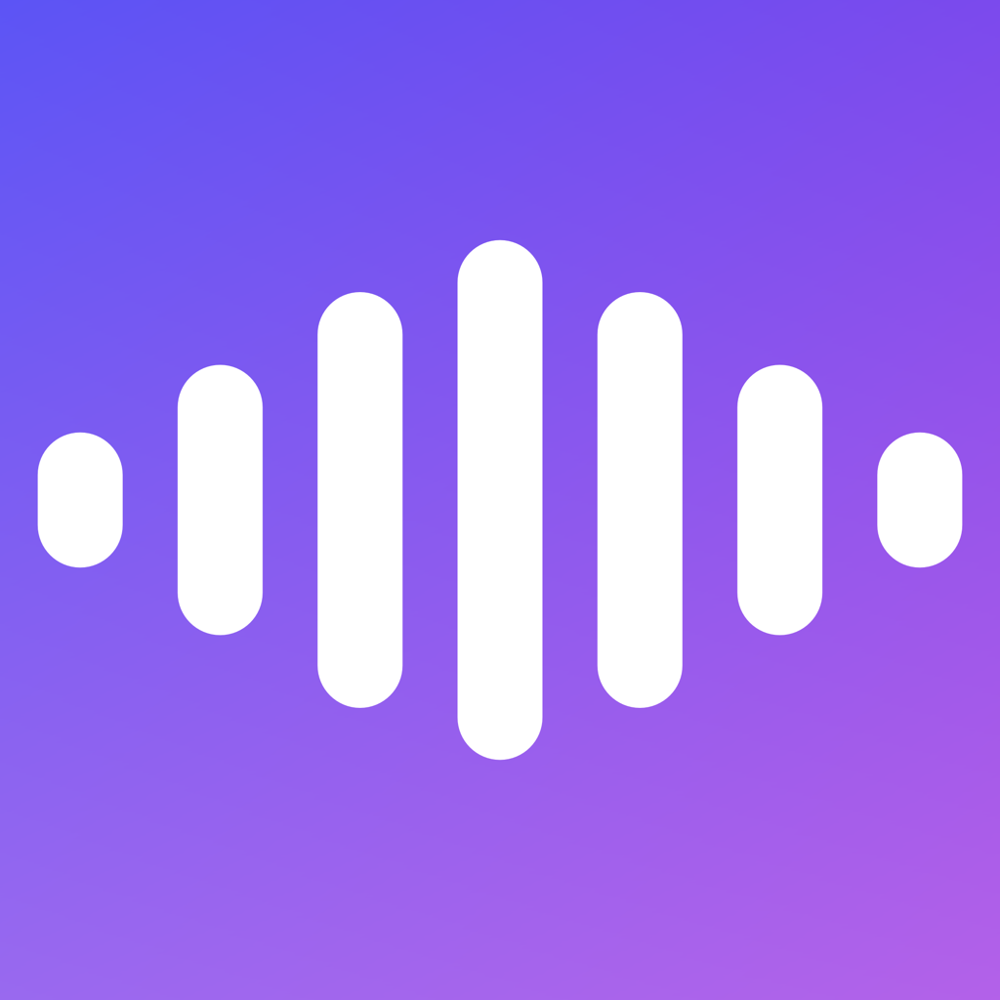

# Bunyi

**Bunyi** (pronounced *BOON-yee*, IPA /ˈbuːɲi/ — the "ny" is the palatal
nasal, like the "ñ" in *jalapeño* or the "ni" in *onion*) is Malay/Indonesian
for **"sound"**.

Local, no-terminal desktop text-to-speech using
[Qwen3-TTS](https://github.com/QwenLM/Qwen3-TTS), for non-technical users:
models auto-download with a progress bar, three modes (preset voices, voice
design, voice cloning), and outputs are playable WAVs. Built to run natively
on **macOS, Windows, and Linux**.

Home: [bunyi.app](https://bunyi.app)

**Download:** [Bunyi 1.0.0](https://github.com/shaztechio/bunyi-app/releases/latest)
— a signed and notarized `.dmg` for Apple Silicon Macs on macOS 15 or later.
Drag it to Applications and launch; no Gatekeeper warnings, no terminal.

## How it's structured

Qwen3-TTS has no single cross-platform runtime — MLX is Apple-Silicon only —
so this is a monorepo of **native apps per platform kept at feature parity by
a shared spec**, not shared code.

| Path | Target | Stack | Status |
|------|--------|-------|--------|
| [`apps/macos/`](apps/macos/) | macOS (Apple Silicon) | Swift + MLX + SwiftUI | **working** |
| [`apps/dotnet/`](apps/dotnet/) | Windows **and** Linux | C# .NET + Avalonia + ONNX Runtime | **working** — preset voice and voice design |
| [`spec/`](spec/) | all | — | source of truth |

Three operating systems, two codebases, one spec.

## The spec is the source of truth

Feature parity is a discipline, enforced by documents — see
[`AGENTS.md`](AGENTS.md) for the rule. Before changing any feature, read:

- [`spec/FEATURES.md`](spec/FEATURES.md) — every feature and its behavior
- [`spec/DATA-FORMATS.md`](spec/DATA-FORMATS.md) — on-disk layout, `manifest.txt`,
  `voices.json`, backup zip, output WAV (so a models folder or backup is
  interchangeable between apps of the same runtime family)

Any feature change updates the spec **and** every app.

## Building

- **macOS** → [`apps/macos/README.md`](apps/macos/README.md) /
  [`apps/macos/AGENTS.md`](apps/macos/AGENTS.md) (XcodeGen + xcodebuild).
- **Windows / Linux** → [`apps/dotnet/AGENTS.md`](apps/dotnet/AGENTS.md)
  (`dotnet build`, .NET 10 SDK). All three modes work. Releases are portable
  self-contained builds — unzip and run, with no runtime to install.

## Code signing policy

Free code signing provided by [SignPath.io](https://signpath.io), certificate by
[SignPath Foundation](https://signpath.org).

**Team roles** — committers, reviewers and approvers:
Shazron Abdullah ([@shazron](https://github.com/shazron)).

**Privacy.** This program does not transfer any information to other networked
systems unless you ask it to. Models are downloaded from the source you choose
the first time you use a mode; generation happens on your own machine, and the
audio never leaves it.

Hosting the models yourself (when the Hub is slow, or you are serving a team):
[`SELF-HOSTING.md`](SELF-HOSTING.md), and [`CACHING.md`](CACHING.md) for
putting that bucket behind a CDN once it is serving — plus what to set up so
the bill cannot surprise you.

CI: [`.github/workflows/`](.github/workflows/) builds macOS (green) and the
.NET matrix for Windows + Linux, both green.
[`release.yml`](.github/workflows/release.yml) builds, Developer ID signs,
notarizes, staples, and publishes the macOS app — tags and manual runs only.
See [`apps/macos/AGENTS.md`](apps/macos/AGENTS.md) for the release and help-book
details.

## License

[Apache-2.0](LICENSE). Every source file carries the license header at the top.
